## CONTINUOUS-INTEGRATION-CI-WITH-JENKINS-ANSIBLE-ARTIFACTORY-SONARQUBE-PHP
-------------
### Experience CONTINUOUS INTEGRATION (CI) WITH JENKINS | ANSIBLE | ARTIFACTORY | SONARQUBE | PHP
--------------

### What is Continuous Integration?
------

In software engineering, Continuous Integration (CI) is a practice of merging all developers’ working copies to a shared mainline (e.g., Git Repository or some other version control system) several times per day. Frequent merges reduce chances of any conflicts in code and allow to run tests more often to avoid massive rework if something goes wrong. This principle can be formulated as Commit early, push often.
The general idea behind multiple commits is to avoid what is generally considered as Merge Hell or Integration hell. When a new developer joins a new project, he or she must create a copy of the main codebase by starting a new feature branch from the mainline to develop his own features (in some organization or team, this could be called a develop, main or master branch). If there are tens of developers working on the same project, they will all have their own branches created from mainline at different points in time. Once they make a copy of the repository it starts drifting away from the mainline with every new merge of other developers’ codes. If this lingers on for a very long time without reconciling the code, then this will cause a lot of code conflict or Merge Hell, as rightly said. Imagine such a hell from tens of developers or worse, hundreds. So, the best thing to do, is to continuously commit & push your code to the mainline. As many times as tens times per day. With this practice, you can avoid Merge Hell or Integration hell.
CI concept is not only about committing your code. There is a general workflow, let us start it…
Run tests locally: Before developers commit their code to a central repository, it is recommended to test the code locally. So, [Test-Driven Development (TDD)](https://en.wikipedia.org/wiki/Test-driven_development) approach is commonly used in combination with CI. Developers write tests for their code called unit-tests, and before they commit their work, they run their tests locally. This practice helps a team to avoid having one developer’s work-in-progress code from breaking other developers’ copy of the codebase.
Compile code in CI: After testing codes locally, developers commit and push their work to a central repository. Rather than building the code into an executable locally, a dedicated CI server picks up the code and runs the build there. In this project we will use, already familiar to you, Jenkins as our CI server. Build happens either periodically – by polling the repository at some configured schedule, or after every commit. Having a CI server where builds run is a good practice for a team, as everyone has visibility into each commit and its corresponding builds.
Run further tests in CI: Even though tests have been run locally by developers, it is important to run the unit-tests on the CI server as well. But, rather than focusing solely on unit-tests, there are other kinds of tests and code analysis that can be run using CI server. These are extremely critical to determining the overall quality of code being developed, how it interacts with other developers’ work, and how vulnerable it is to attacks. A CI server can use different tools for Static Code Analysis, Code Coverage Analysis, Code smells Analysis, and Compliance Analysis. In addition, it can run other types of tests such as Integration and Penetration tests. Other tasks performed by a CI server include production of code documentation from the source code and facilitate manual quality assurance (QA) testing processes.
Deploy an artifact from CI: At this stage, the difference between CI and CD is spelt out. As you now know, CI is Continuous Integration, which is everything we have been discussing so far. CD on the other hand is Continuous Delivery which ensures that software checked into the mainline is always ready to be deployed to users. The deployment here is manually triggered after certain QA tasks are passed successfully. There is another CD known as Continuous Deployment which is also about deploying the software to the users, but rather than manual, it makes the entire process fully automated. Thus, Continuous Deployment is just one step ahead in automation than Continuous Delivery.

### Continuous Integration in The Real World
To emphasize a typical CI Pipeline further, let us explore the diagram below a little deeper.

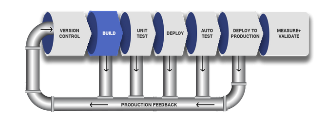

### SIMULATING A TYPICAL CI/CD PIPELINE FOR A PHP BASED APPLICATION
As part of the ongoing infrastructure development with Ansible started from Project 11, you will be tasked to create a pipeline that simulates continuous integration and delivery. Target end to end CI/CD pipeline is represented by the diagram below. It is important to know that both Tooling and TODO Web Applications are based on an interpreted (scripting) language (PHP). It means, it can be deployed directly onto a server and will work without compiling the code to a machine language.
The problem with that approach is, it would be difficult to package and version the software for different releases. And so, in this project, we will be using a different approach for releases, rather than downloading directly from git, we will be using [Ansible uri module](https://docs.ansible.com/ansible/latest/collections/ansible/builtin/uri_module.html).

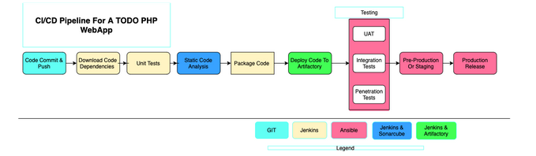

### Set Up
This project is partly a continuation of your Ansible work, so simply add and subtract based on the new setup in this project. It will require a lot of servers to simulate all the different environments from dev/ci all the way to production. This will be quite a lot of servers altogether (But you don’t have to create them all at once. Only create servers required for an environment you are working with at the moment. For example, when doing deployments for development, do not create servers for integration, pentest, or production yet).

To get started, we will focus on these environments initially.
* Ci
* Dev
* Pentest
Both System Integration Testing (SIT) and UAT – User Acceptance Testing do not require a lot of extra installation or configuration. They are basically the webservers holding our applications. But Penetration testing is where we will conduct security related tests, so some other tools and specific configurations will be needed. In some cases, it will also be used for Performance and Load testing. Otherwise, that can also be a separate environment on its own. It all depends on decisions made by the company and the team running the show.
What we want to achieve, is having Nginx to serve as a reverse proxy for our sites and tools. Each environment setup is represented in the below table and diagrams.

### Table
---------

   CI  |  DEV  |  SIT  |  UAT  |  PENTEST  | PRE-PROD | PROD |
|------|-------|-------|--------|----------|----------|---------|
|Nginx| Nginx|Nginx|Nginx|Nginx| Nginx| Nginx |
|Sonarqube|Tooling|Tooling |Tooling|Tooling|Tooling|Tooling|
|Artifactory |TODO  WebApp|TODO  WebApp|TODO  WebApp|TODO  WebApp|TODO  WebApp|TODO  WebApp
   |Jenkins|  __   |  __  |  __  |  __  |  __  |    __|

### CI-Environment
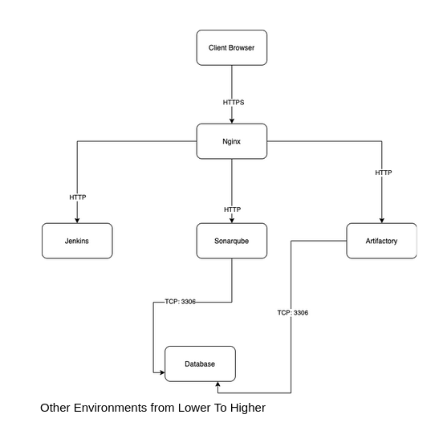

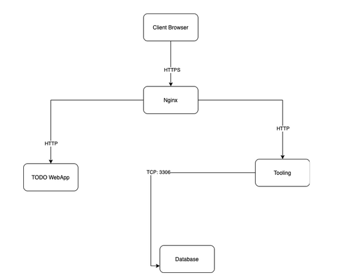

#### Ansible Inventory should look like this

    ├── ci
    ├── dev
    ├── pentest
    ├── pre-prod
    ├── prod
    ├── sit
    └── uat

#### ci inventory file
    [jenkins]
    <Jenkins-Private-IP-Address>

    [nginx]
    <Nginx-Private-IP-Address>

    [sonarqube]
    <SonarQube-Private-IP-Address>

    [artifact_repository]
    <Artifact_repository-Private-IP-Address>

#### dev Inventory file
    [tooling]
    <Tooling-Web-Server-Private-IP-Address>

    [todo]
    <Todo-Web-Server-Private-IP-Address>

    [nginx]
    <Nginx-Private-IP-Address>

    [db:vars]
    ansible_user=ec2-user
    ansible_python_interpreter=/usr/bin/python

    [db]
    <DB-Server-Private-IP-Address>

#### pentest inventory file
    [pentest:children]
    pentest-todo
    pentest-tooling

    [pentest-todo]
    <Pentest-for-Todo-Private-IP-Address>

    [pentest-tooling]
    <Pentest-for-Tooling-Private-IP-Address>

ANSIBLE ROLES FOR CI ENVIRONMENT

Now go ahead and Add two more roles to ansible:

    SonarQube (Scroll down to the Sonarqube section to see instructions on how to set up and configure SonarQube manually)
    Artifactory

### Configuring the Jenkins Server

    Install jenkins with its dependencies using the official documentation from Jenkins here

### Update the bash profile

    sudo -i

    vi .bash_profile

 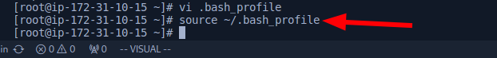

    export JAVA_HOME=$(dirname $(dirname $(readlink $(readlink $(which java)))))
    export PATH=$PATH:$JAVA_HOME/bin 
    export CLASSPATH=.:$JAVA_HOME/jre/lib:$JAVA_HOME/lib:$JAVA_HOME/lib/tools.jar

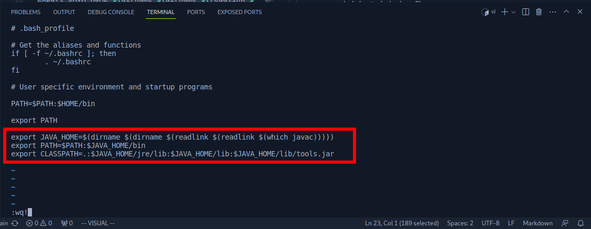

Reload the bash profile

    source ~/.bash_profile

NB: This is done so that the path is exported anytime the machine is restarted

Install jenkins from the official [documentation](https://www.jenkins.io/doc/book/installing/linux/#red-hat-centos)

Start the jenkins server

    sudo systemctl start jenkins
    sudo systemctl enable jenkins
    sudo systemctl status jenkins

 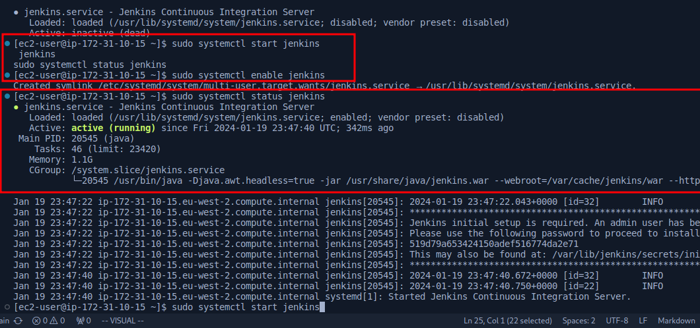

Install git and clone down your [ansible-congig-mgt](https://github.com/lateef-taiwo/ANSIBLE-PROJECTS.git) repository

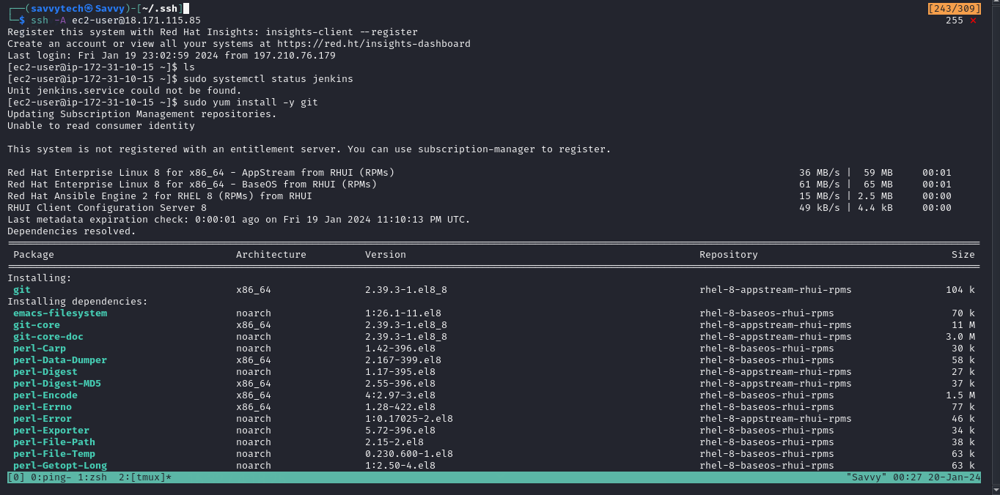

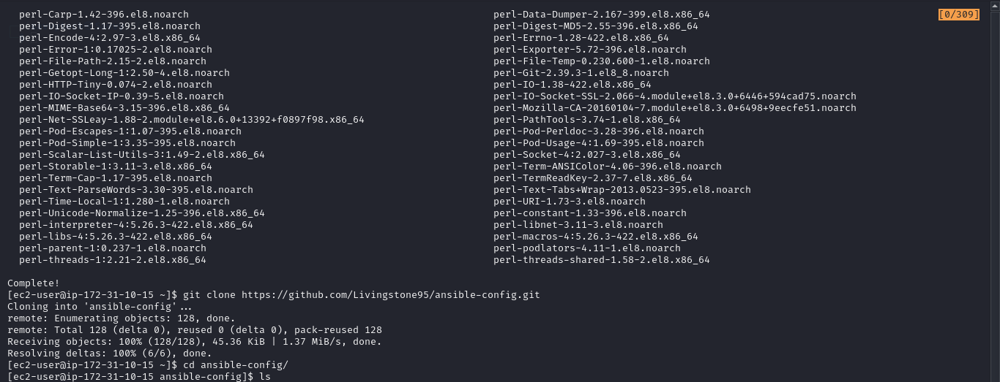

### Configuring Ansible For Jenkins Deployment
In previous projects, you have been launching Ansible commands manually from a CLI. Now, with Jenkins, we will start running Ansible from Jenkins UI. To do this,

1. Navigate to Jenkins URL
2. Install & Open Blue Ocean Jenkins Plugin

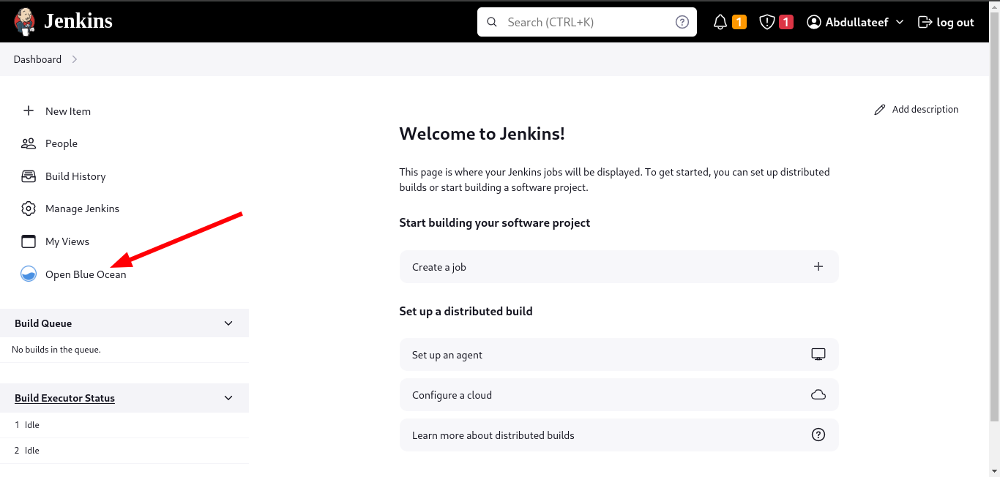

3. Create a new pipeline

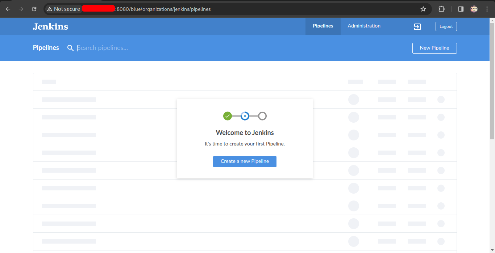

4. Select GitHub

5. Login to GitHub & Generate an Access Token

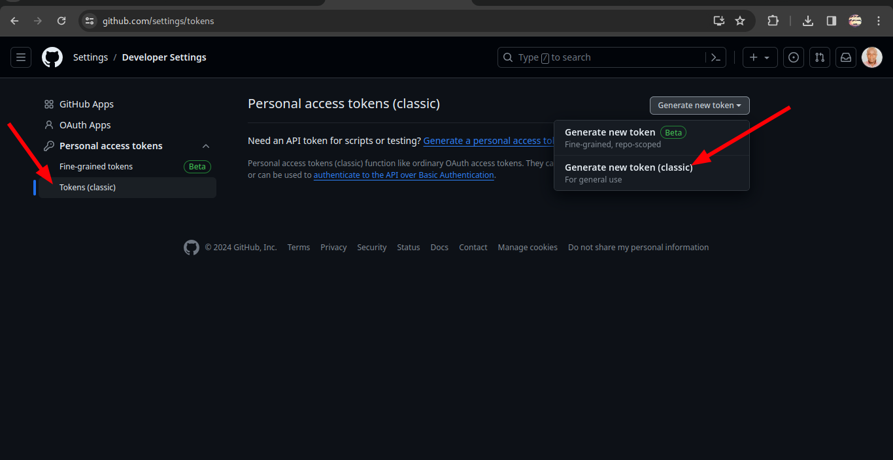
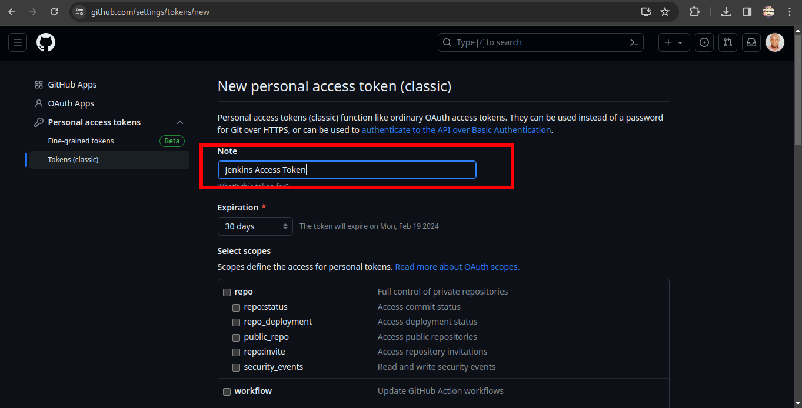

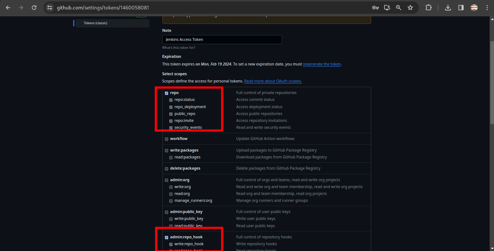

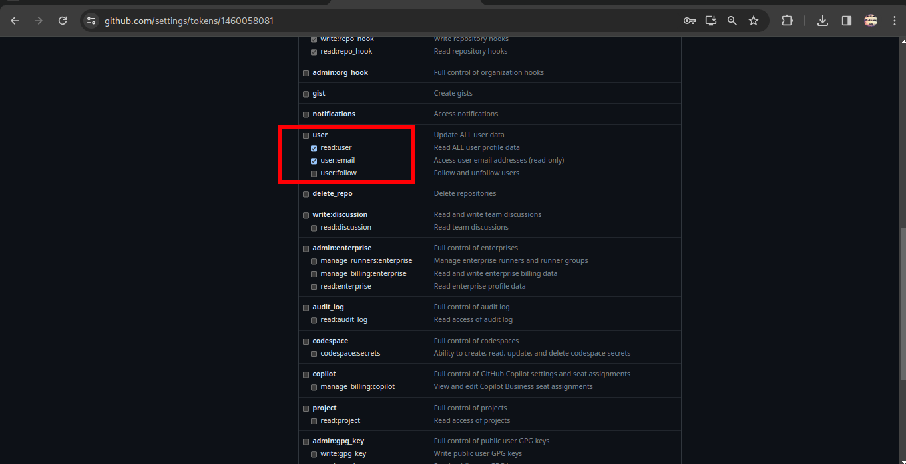

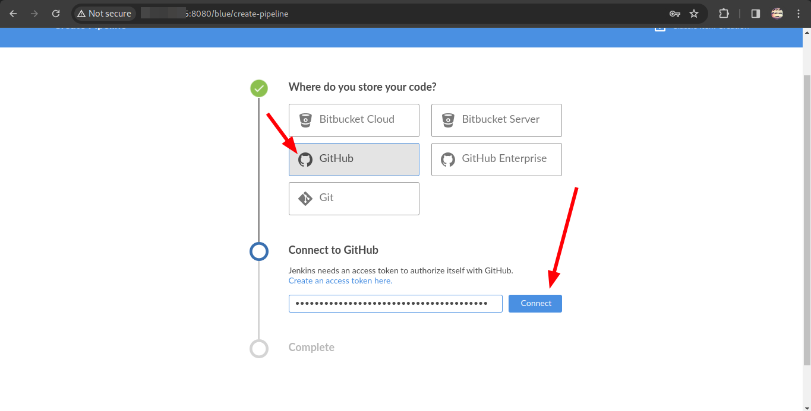

6. Copy Access Token

7. Paste the token and connect

8. Create a new pipelne

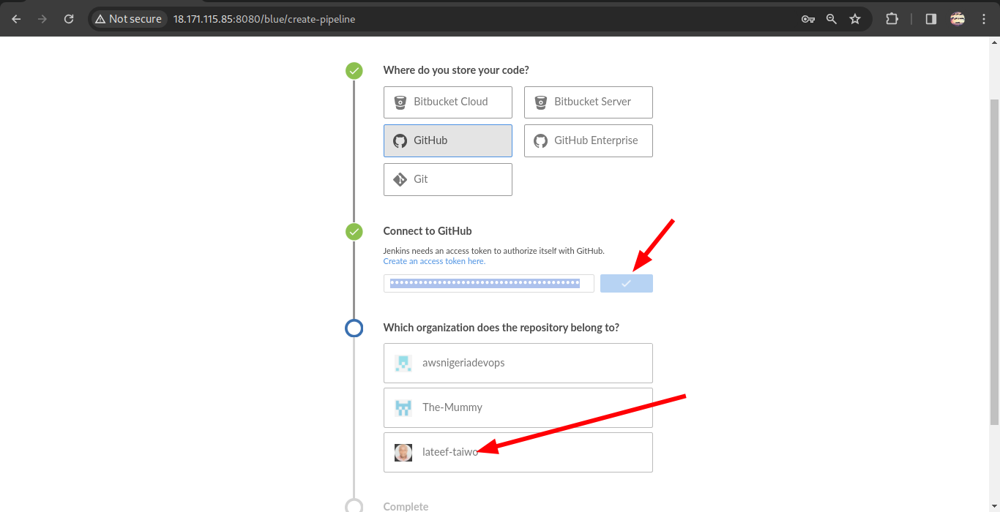

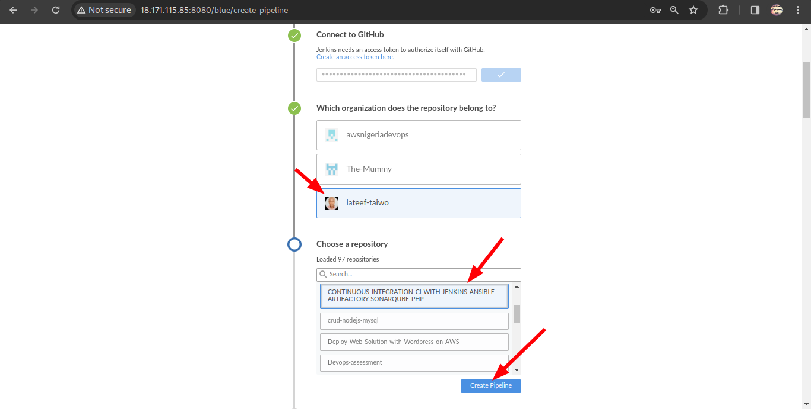

At this point you may not have a Jenkinsfile in the Ansible repository, so Blue Ocean will attempt to give you some guidance to create one. But we do not need that. We will rather create one ourselves. So, click on Administration to exit the Blue Ocean console.

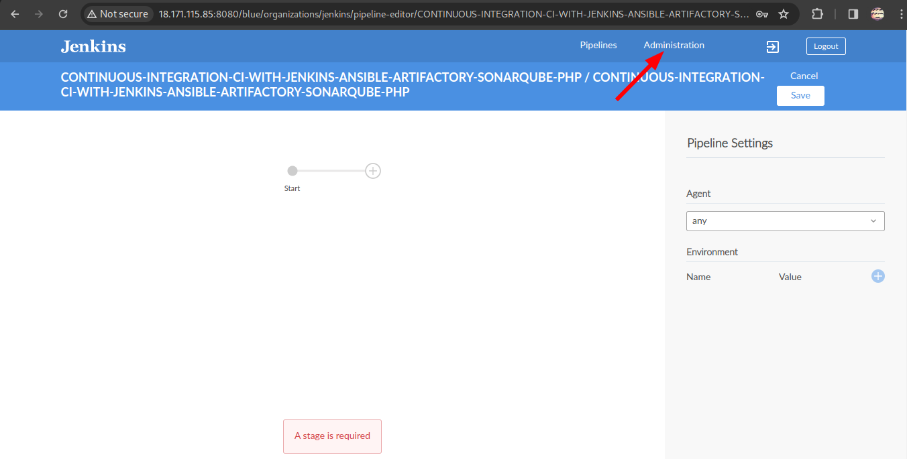

#### Create our Jenkinsfile

Inside the Ansible project, create a new directory deploy and start a new file Jenkinsfile inside the directory. For me, I created a new repository for this project and copied the contents of the ansible-config-artifact repository to it.